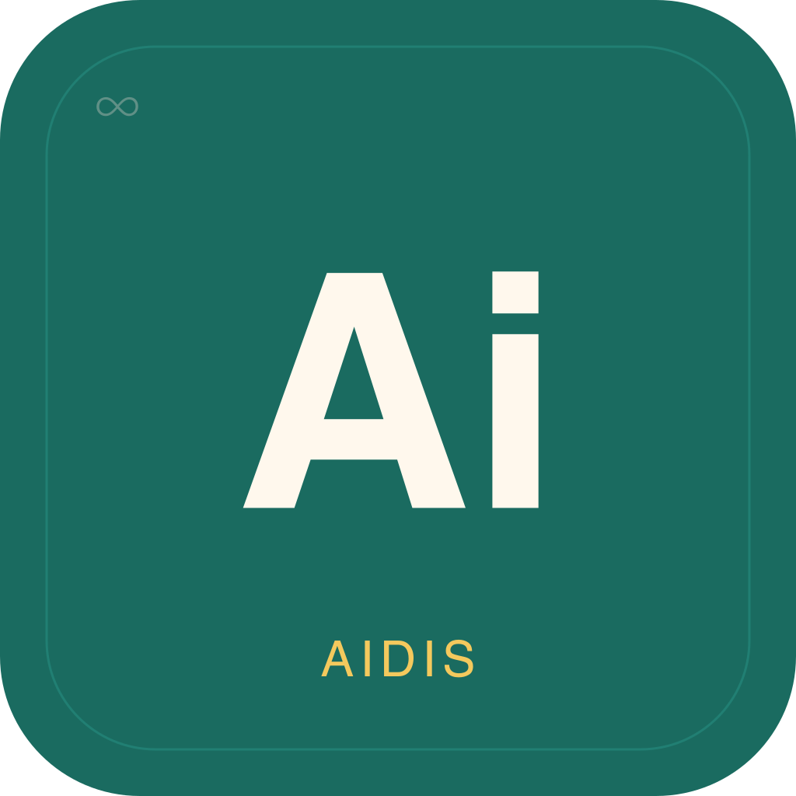

  

<h1 align="center">Aidis Desktop</h1>

A desktop application for managing AI agents. Configure your agent, manage skills, tune settings, and monitor status — all from a native desktop interface.

---

## Download

### macOS

| Download | Architecture |
|----------|-------------|
| [Aidis.dmg (Apple Silicon)](https://github.com/nicholasbester/aidis-releases/releases/latest/download/Aidis-arm64.dmg) | Apple Silicon (M1/M2/M3/M4) |
| [Aidis.dmg (Intel)](https://github.com/nicholasbester/aidis-releases/releases/latest/download/Aidis-x64.dmg) | Intel x64 |

### Linux

| Download | Format |
|----------|--------|
| [Aidis.AppImage](https://github.com/nicholasbester/aidis-releases/releases/latest/download/Aidis.AppImage) | AppImage (universal) |
| [Aidis.deb](https://github.com/nicholasbester/aidis-releases/releases/latest/download/aidis-desktop.deb) | Debian/Ubuntu |

## Requirements

- **zeroclaw CLI** installed and available on your `PATH`
- An AI provider API key (OpenRouter, Anthropic, OpenAI, Ollama, etc.)

## What is Aidis?

Aidis is a desktop management interface for AI agents powered by the zeroclaw runtime. Features include:

- Real-time daemon monitoring and diagnostics
- Agent personality and behavior configuration
- 20+ messaging channel integrations (Telegram, Discord, Slack, WhatsApp, etc.)
- Skills marketplace with install/audit/test
- Mission planning with AI-powered analysis
- Full configuration editor with 32 settings sections
- Hardware/IoT peripheral management

## License

BSL-1.1 — see the source repository for details.
